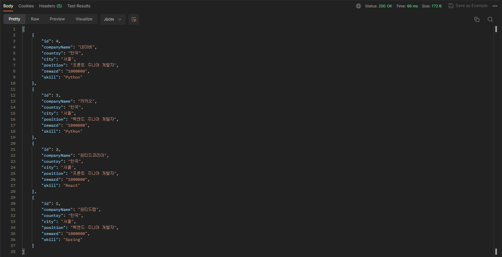
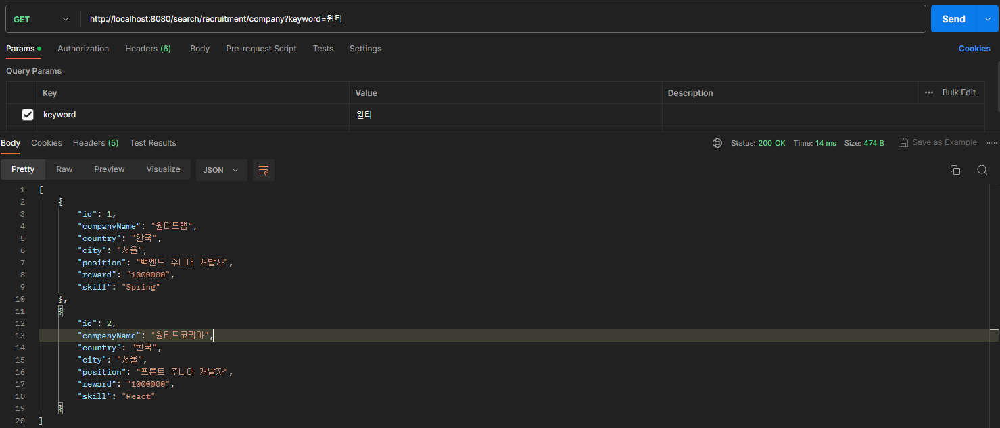

# 원티드 프리온보딩 백엔드 인턴십 선발과제

## 1. 요구사항 분석
### 1.1 채용공고 등록
#### 신청 URL : http://localhost:8080/add/recruitment
#### Request 타입 : POST
회사모델이 따로 있으므로 회사모델에서 id값을 회사_id(CompanyId)로 사용 
나머지 데이터는 position, reward, details, skill로 필드명을 변경하여 사용하였습니다.

### 1.2 채용공고 수정
#### 신청 URL : http://localhost:8080/update/recruitment/{id}
#### Request 타입 : PUT
채용공고의 id값과 
변경할 position, reward, details, skill값을 받아와 변경할 수 있게 하였습니다. 변경하지 않은 값이 존재해도 원래 값을 입력해야합니다.

### 1.3 채용공고 삭제
#### 신청 URL : http://localhost:8080/delete/recruitment/{id}
#### Request 타입 : DELETE
삭제할 채용공고의 id값을 받아와 제거합니다.

### 1.4 채용공고 목록 가져오기
#### 1.4.1 채용공고 전체 리스트
#### 신청 URL : http://localhost:8080/list/recruitment
#### Request 타입 : GET
채용공고 리스트를 가져옵니다. 최신순으로 가져오도록 되어있습니다.

#### 1.4.2 채용공고 검색
#### 신청 URL (회사검색) : http://localhost:8080/search/recruitment/company?keyword={keyword} 
#### 신청 URL (포지션 검색) : http://localhost:8080/search/recruitment/position?keyword={keyword} 
#### Request 타입 : GET
쿼리스트링으로 구현해보았습니다.

### 1.5 채용상세 페이지
#### 신청 URL : http://localhost:8080/detail/recruitment/{id}
#### Request 타입 : GET
상세 페이지를 볼 채용공고 id를 받아 값을 돌려줍니다.
회사가 올린 다른 채용공고는 자기가 보고있는 채용공고를 포함해 모두 보여줍니다.

### 1.6 채용공고 지원
#### 신청 URL : http://localhost:8080/apply/recruitment
#### Request 타입 : POST
구현을 위해 지원내역 모델을 만들어 채용공고id와 유저id를 입력받아 저장하고 이미 존재할 경우 true값을 반환하며 처음 저장 할 경우 false를 반환합니다.

## 2. 구현과정
### 2.1 DB 설계 및 연결
기본적으로 필요한 테이블이 존재했기 때문에 먼저 회사, 사용자, 채용공고 테이블을 생성하여 과제내용에 들어있는 내용을 채우고 ORM 기술을 활용하기위해 JPA를 활용하였습니다. DB는 MySQL을 사용하였고 설정와 sql파일을 통해 더미데이터를 만들고 어플리케이션 재시작시 DB가 초기화 되도록 세팅하고 진행하였습니다.

### 2.2 API 구현
CRUD 순으로 구현하기로 정한뒤 선발과제 노션을 API 명세서로 보고 구현을 시작하였습니다. 채용공고 등록 부분은 더미데이터로 회사와 유저정보가 존재하기에 채용공고만 만들면되어 간단하였고 읽기부분에서 전체리스트를 가져오는 것을 먼저 구현한 후 수정과 삭제는 채용공고의 id를 받아 id값과 일치하는 것을 수정,삭제하도록 구현하였습니다.

### 2.3 추가 기능 구현
#### 2.3.1 검색기능
읽기 부분으로 다시 되돌아가 검색을 구현하려했고 그걸 위해 쿼리스트링을 입력받고 쿼리스트링으로 받아온 값이 회사명일때는 회사명을 기준으로 회사테이블을 참조하도록 하였고 포지션일때는 채용공고테이블을 참조하도록 구현하였습니다.
#### 2.3.2 같은 회사가 올린 다른 공고
회사가 올린 다른 공고를 찾을때는 상세 페이지에 들어갈 때 받아온 채용공고 id값을 이용하여 회사명을 찾고 회사명과 일치하는 채용공고에서 포지션 부분을 가져와 표시하도록 구현하였습니다.
#### 2.3.3 유저의 채용공고 지원
공고 지원자체는 구현하기 쉬웠으나 한번만 가능하도록 하기위해 DB에 지원한 내역을 저장하도록 하기위해 지원 테이블을 하나 추가하여 채용공고id와 유저id를 받아 저장하고 일치하는지 확인 후 일치한 데이터가 존재하면 저장하지 않고 true를 반환 존재하지않으면 저장 후 false를 반환하도록 구현하였습니다.
#### 2.3.4 Unit Test
Spring-boot-starter-test를 사용해 간단하게 CRUD를 테스트하는 코드를 작성하였습니다.

## 3. 추가 정보
### Java 버전 : 11
### Spring Boot 버전 : 2.7.16
### MySQL 버전 : 8.0.33
### 테스트 툴 : PostMan
#### ignore 처리에 관한 정보가 설명되어있지 않아서 따로 처리를 하지않았고 더미데이터를 담도록한 sql 파일과 yml 설정파일이 그대로 올라가 있습니다.
#### 현재 어플실행시 DB 초기화 + 더미데이터 추가되도록 되어있습니다.
